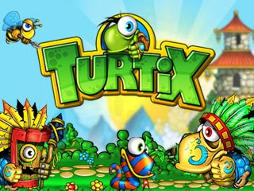

# Turtix Game



Welcome to **Turtix**, an adventure game developed with C++ and the SFML library. In this game, you control a character (Turtix) as they navigate through various levels and obstacles. This is an early version of the game, showcasing basic gameplay elements.

## Features
- Control Turtix through different terrains.
- Collect items and navigate obstacles.
- Interact with objects and explore the environment.

## Requirements
- **SFML Library**: Make sure you have the SFML library installed (version 2.5 or higher is recommended).

## Installation
1. Clone or download this repository.
2. Navigate to the project directory.
3. Compile the code using the provided Makefile:
   ```bash
   make

## Controls
1. Arrow Keys: Move Turtix
1. Space: Jump
## Project Structure
1. main.cpp: Game entry point.
2. Turtle.hpp / Turtle.cpp: Core character logic.
3. Map.hpp / Map.cpp: Map and level design.
4. Picture/: Directory containing game assets (images).
5. Maps/: Directory with map files.
